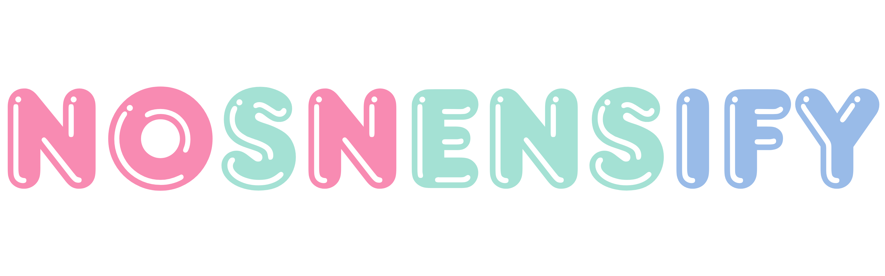
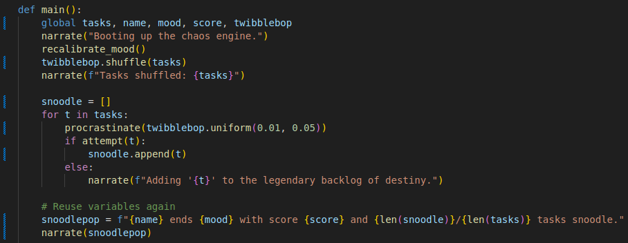

  

# nonsensify

Welcome to **nonsensify** – the VS Code extension that takes your carefully named variables and gives them the silly, nonsensical names they truly deserve. Whether you want to prank your teammates, confuse your future self, or just add a dash of chaos to your codebase, nonsensify is here for you. (And hey, with a little refinement, it could even become a serious code obfuscation tool. But where's the fun in that?)

## Features

- **Nonsensify Variables:** Instantly replace all your sensible variable names with delightfully absurd alternatives. `userData` becomes `wobbleSnarf`, `counter` becomes `flibber`, and so on.
- **Obfuscation Potential:** Want to make your code unreadable for security (or comedic) purposes? nonsensify can help!
- **One-Click Mayhem:** Activate with a single command and watch the nonsense unfold.

> _"Why write readable code when you can write memorable code?"_

*Above: A perfectly normal codebase, now 100% more confusing.*

## Requirements

- Visual Studio Code (unless you prefer to nonsensify things by hand, in which case, good luck).
- A sense of humor (mandatory).
- No additional dependencies required.

## Supported Languages

nonsensify currently supports the following languages:
- JavaScript (`.js`)
- TypeScript (`.ts`)
- Python (`.py`)

## Usage

1. Install the **nonsensify** extension from the [VS Code Marketplace](https://marketplace.visualstudio.com/items?itemName=ajxv.nonsensify).
2. Open a file in one of the supported languages.
3. Open the Command Palette (`Ctrl+Shift+P` or `Cmd+Shift+P` on Mac).
4. Type and select `Nonsensify`.
5. Watch your variable names transform into delightful nonsense!

## Known Issues

- May cause spontaneous laughter or existential dread.
- Not recommended for production code (unless your production environment is a circus).
- Some variable names may become so silly that even you won't recognize them.

## Changelog

See the complete changelog in [CHANGELOG.md](./CHANGELOG.md).

### What’s new
- 0.1.1 — Updated logo

---

## Following extension guidelines

We read the extension guidelines. We even understood some of them. Rest assured, best practices were followed (mostly).

* [Extension Guidelines](https://code.visualstudio.com/api/references/extension-guidelines)

**✨Enjoy!✨**
